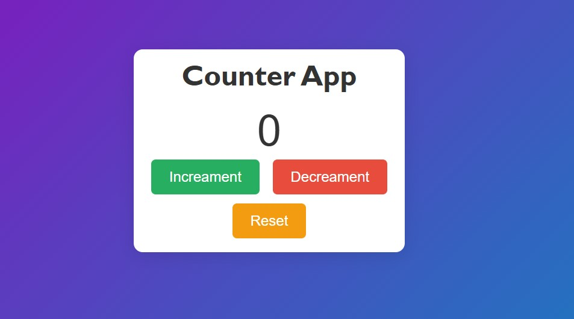

# 🔢 Counter App  

<p align="center">
  
</p>

<p align="center">
  A simple and interactive counter application built using HTML, CSS, and JavaScript.
</p>

---

## 🌍 Live Preview  

👉 **Live Demo:**  
https://counter-app-theta-two-60.vercel.app/
---

## 📌 Description  

The Counter App is a beginner-friendly front-end project that demonstrates **DOM manipulation, event handling, and dynamic UI updates** using Vanilla JavaScript.  

Users can increment, decrement, and reset the counter value instantly with a clean and responsive interface.

---

## 🚀 Features  

- ➕ Increment Counter  
- ➖ Decrement Counter  
- 🔄 Reset Counter  
- 🎨 Gradient Background UI  
- ⚡ Smooth Button Hover Effects  
- 📱 Responsive Layout  

---

## 🛠 Tech Stack  

### 🎨 Frontend
- HTML5  
- CSS3 (Flexbox + Gradient Design)  
- JavaScript (DOM Manipulation & Event Handling)  

---

## 📥 Installation & Setup  

### 🔹 Clone the Repository  

```bash
git clone https://github.com/Jishanahmad786/counter-app.git
```

### 🔹 Navigate into the Project Folder  

```bash
cd counter-app
```

### 🔹 Run the Application  

Simply open:  

```
index.html
```

Or use **Live Server** in VS Code.

---

## 📂 Project Structure  

```
counter-app/
│
├── index.html
├── style.css
├── script.js
├── screenshots/
│   └── counter-preview.png
└── README.md
```

---

## 📸 Screenshots  


  


---

## 💡 Future Improvements  

- Prevent negative values  
- Add LocalStorage support  
- Add sound effects  
- Add animation on increment/decrement  
- Dark mode toggle  

---

## 👨‍💻 Author  

**Md Jishan Ahmad**  

📧 Email: mdjishanahmad442@gmail.com  
🔗 GitHub: https://github.com/Jishanahmad786  

---

⭐ If you like this project, don't forget to give it a star!
